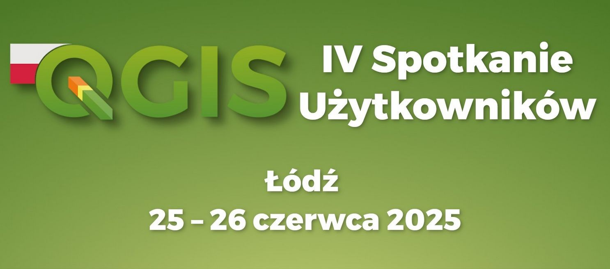

# Warsztaty LizMap Web Client: Tworzenie i publikowanie projektów QGIS w sieci
Materiały na warsztaty LizMap Web Client: Tworzenie i publikowanie projektów QGIS w sieci  w ramach IV Spotkania Użytkowników QGIS 2025 w Łodzi.



### Instrukcja konfiguracji środowiska pracy na warsztaty LizMap – Windows
[Pobierz instrukcję PDF](instrukcja%20przygotowania%20oprogramowania%20na%20warsztaty%20LizMap.pdf")

### obraz maszyny wirtualnej z LizMapą
[Pobierz obraz maszyny wirtualnej](https://downloads.envirosolutions.pl/ubuntu.zip)

### Projekty LizMap
projekty, które są również na maszynie wirtualnej, znajdują się w katalogu: `projekty` w repozytorium git.

### Hasła i dostępy
#### Baza danych
```
user: admin
pass: admin
baza: gis
host: localhost
port: 15432
```

#### Linux (ubuntu)
```
user: request
pass: request123
ssh: localhost:2222
sftp: sftp://localhost:2222
```
#### LizMap
```
user: admin
pass: admin
url: http://localhost:8888
```